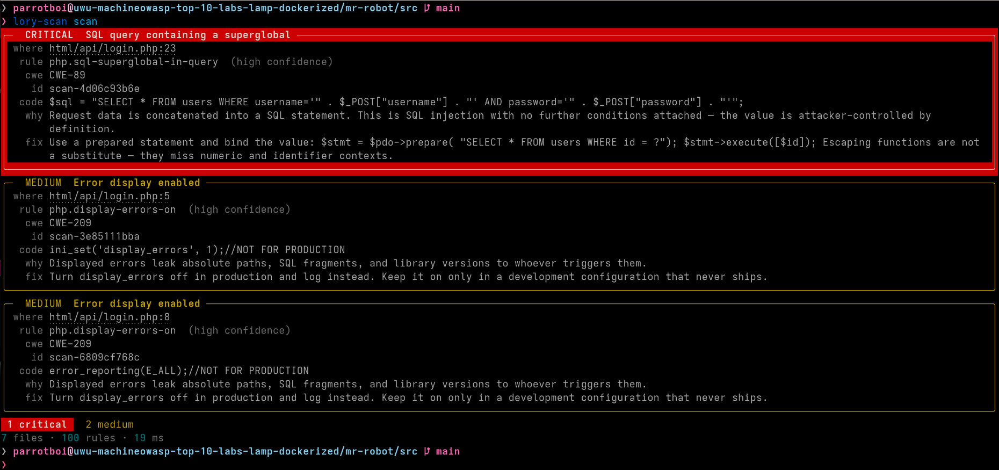

# Lory Code Security Scanner

**A local static security scanner for source trees.**

*The half of the engagement that happens before the report.*


> **Alpha.** The rule ids and the config schema may still change between minor
> versions. The output contract that other tools integrate against is
> versioned separately and reported by `lory-scan describe`.

`lory-scan` reads your source and reports the security problems it can see:
injection sinks, hardcoded credentials, weak cryptography, unsafe
deserialisation, and dangerous configuration — across Python, JavaScript,
TypeScript, PHP, Java, Kotlin, Go, C#, Ruby, shell, Dockerfiles, Kubernetes
manifests, Terraform, and CI workflows.

> **Nothing leaves your machine.** There is no account, no API key, and no
> network call in a scan. The rules are files in this package and they run
> against files on your disk.

It is the scanning half of the Lorikeet terminal toolchain. Its companion,
[`lory-code-security`](https://github.com/Lorikeet-Security/lory-findings-tui),
is a findings cockpit that triages findings and asks **Lory** how to fix them
but scans nothing itself. This tool scans, and hands its findings straight to
that one:

```bash
lory-scan sync        # scan this repo
lory tui --cached     # triage what it found
```

---

## Table of Contents

- [Overview](#overview)
- [What it finds, and what it does not](#what-it-finds-and-what-it-does-not)
- [Install](#install)
- [Quick start](#quick-start)
- [Setting a repository up](#setting-a-repository-up)
- [Working with the findings TUI](#working-with-the-findings-tui)
- [Command reference](#command-reference)
- [Output formats](#output-formats)
- [Suppressing a finding](#suppressing-a-finding)
- [Baselines: adopting the scanner on an existing codebase](#baselines-adopting-the-scanner-on-an-existing-codebase)
- [Rules](#rules)
  - [Writing your own](#writing-your-own)
  - [Rule self-tests](#rule-self-tests)
- [CI](#ci)
- [Configuration](#configuration)
- [Architecture](#architecture)
- [Performance](#performance)
- [What leaves your machine](#what-leaves-your-machine)
- [Development](#development)
- [Roadmap](#roadmap)
- [Legal & authorized use](#legal--authorized-use)
- [License](#license)

---

## Overview

Most security findings reach a developer long after the code was written, in a
PDF, described in terms of a URL rather than a file. `lory-scan` runs on the
tree in front of you and reports in the only vocabulary that helps —
`path:line`, the line itself, and what to do about it.



Every finding carries:

| | |
|---|---|
| **Where** | file, line, column, and the source line |
| **What** | a title, a description of why it is dangerous, and a concrete fix |
| **How bad** | one of five severities |
| **How sure** | a confidence, because a static match is a lead and not a proof |
| **Which class** | a CWE id, and an OWASP Top 10 category where one applies |
| **Identity** | a fingerprint that survives edits elsewhere in the file |

That last one is what makes the tool usable across runs. A finding is
identified by a hash of the rule, the file, and the matched text — not by its
line number — so adding an import above it does not turn it into a new
finding, and your triage notes stay attached to the thing you made them about.

---

## What it finds, and what it does not

**It finds** patterns with metadata attached — roughly 100 rules, each with a
CWE, a severity, a confidence, and a remediation:

- **Secrets** — AWS, GitHub, GitLab, Slack, Stripe, Google, Twilio, SendGrid,
  npm, and model-provider keys; private key blocks; connection strings with
  inline passwords; committed `.env` files; plus generic high-entropy
  credential detection for everything with no recognisable shape.
- **Injection** — SQL built by concatenation or interpolation, shell commands
  assembled from variables, `eval` on dynamic expressions, NoSQL operator
  injection, PHP file inclusion.
- **Deserialisation** — `pickle`, unsafe `yaml.load`, PHP `unserialize`, Java
  `readObject`, .NET `BinaryFormatter`, Ruby `Marshal`.
- **Cryptography** — disabled TLS verification, trust-everything certificate
  handlers, MD5 and SHA-1 where they matter, ECB mode, non-cryptographic
  randomness used for tokens.
- **Web** — XSS sinks, CORS wildcards paired with credentials, JWT
  verification switched off, open redirects, missing cookie flags.
- **Configuration** — debug mode enabled, privileged containers, public
  buckets and security groups, unencrypted storage, `pull_request_target`
  workflows that check out untrusted code with your secrets.

**It does not** build a call graph, track taint across functions, or prove that
a sink is reachable. That is a deliberate boundary, not an oversight: a fast,
honest lead generator that a human confirms in ten seconds beats a slow one
that claims certainty it cannot have. The confidence field is where that
uncertainty lives, and `--min-confidence medium` is the fastest way to quieten
a first scan.

It is also not a dependency scanner. Vulnerable-package detection needs a
vulnerability database, which means network access and a feed to keep current —
a different tool with different guarantees.

---

## Install

```bash
# Recommended: an isolated install, on your PATH.
pipx install lory-code-security-scanner

# Or into the current environment.
pip install lory-code-security-scanner
```

From a checkout:

```bash
git clone https://github.com/Lorikeet-Security/lory-code-security-scanner
cd lory-code-security-scanner
pip install -e ".[dev]"
```

Python 3.11 or newer. Three dependencies — `click`, `pyyaml`, `rich` — the same
three the findings TUI uses, so installing both pulls in nothing new.

---

## Quick start

```bash
# Scan the current directory.
lory-scan scan

# Scan one subtree, and only show what matters today.
lory-scan scan src --min-severity high

# Scan only what your branch changed — the pre-commit and PR shape.
lory-scan scan --diff origin/main

# Machine-readable, for a pipeline.
lory-scan scan --format json --out findings.json
lory-scan scan --format sarif --out findings.sarif

# What would it even look for?
lory-scan rules list --category secrets
lory-scan rules show python.pickle-loads
```

Exit codes, which are the whole interface in CI:

| Code | Meaning |
|---|---|
| `0` | no findings at or above `--fail-on` (default: `high`) |
| `1` | findings at or above `--fail-on` |
| `2` | the scan could not run — bad config, bad rules, unreadable path |
| `130` | interrupted (Ctrl-C) — kept distinct from `1` so an abandoned scan is not read as a failing one |

---

## Setting a repository up

One scan tells you where you stand. `init` is what makes it stick:

```bash
lory-scan init          # asks about each piece
lory-scan init --yes    # takes the defaults
```

It writes four things, any of which you can decline:

| | |
|---|---|
| `.lory-scan.yml` | a starting policy, with the noisy dials pre-set |
| `.lory-scan-baseline.json` | everything that exists today, marked known |
| `.git/hooks/pre-commit` | scans staged files before they are committed |
| `.github/workflows/security-scan.yml` | scans the diff on every PR, uploads SARIF |

The baseline is the part that matters for adoption. A first scan of a mature
repository finds a lot of code that predates everyone reading the output; left
in the way, the whole thing gets ignored. Baselining draws a line under it and
holds new code to the standard, and because fingerprints ignore line numbers,
the file does not go stale when someone reformats.

Nothing is overwritten without asking, everything it writes is a plain file you
can edit, and running it again is safe. Commit the config and the baseline so
the whole team scans the same way.

---

## Working with the findings TUI

[`lory-code-security`](https://github.com/Lorikeet-Security/lory-findings-tui)
is a full-screen cockpit for triaging findings: severity-ordered list, full
detail pane, local triage state, and a chat with Lory about how to fix the one
you are looking at. It reads findings from the Lorikeet platform over MCP — and
it can read this scanner's findings the same way, with no credential and no
network.

```bash
pip install "lory-code-security[tui,scan]"

cd ~/src/myapp
lory scan                 # the cockpit drives this scanner
lory tui --cached         # triage what it found — or press `s` in the cockpit
```

That is the same scan, run from the other side: `lory scan` calls
`lory-scan describe`, checks the contract version, and asks for findings in its
own row format. Driving it from here instead works identically and needs
nothing installed but this package:

```bash
lory-scan sync            # scan, and write .lory_state/findings.json
lory tui --cached
```

`sync` writes the findings cache that tool already reads, so its whole workflow
works on locally scanned findings:

```bash
lory findings list --cached          # severity-ordered table
lory findings show scan-a1b2c3d4e5   # full detail
lory triage scan-a1b2c3d4e5 fixing   # local workflow state
lory fix scan-a1b2c3d4e5             # ask Lory for the code change
```

Three properties make that handoff safe:

- **Platform findings survive.** `sync` keeps rows from other finding stores
  that are already in the cache, so scanning locally never makes the findings
  from your last pentest disappear. `--replace` opts out.
- **Refs never collide.** Scanner findings are namespaced into their own store
  and named `scan-<fingerprint>`, which cannot clash with a platform ref.
- **Findings are complete.** Each row carries its description, evidence, and
  remediation, so the TUI never needs to call the platform to fill one in.

Findings from your Lorikeet account and findings from a local scan sit side by
side in that cockpit: a scan replaces the previous scan, and never touches
findings from another store.

Prefer to pipe it yourself, or integrating something else? The contract is
machine-readable:

```bash
lory-scan describe                                    # the whole contract, as JSON
lory-scan scan . --format lory-json --quiet           # the rows, on stdout
```

`describe` reports a `contract_version` alongside the tool version, so a caller
can refuse a contract it does not understand instead of misreading the output.

---

## Command reference

### `lory-scan scan [PATH]`

Scan a path and report findings. Defaults to the current directory. PATH may
also be a single file.

**What to scan**

| Flag | Effect |
|---|---|
| `--include GLOB` | Only scan paths matching this glob. Repeatable. |
| `--exclude GLOB` | Skip paths matching this glob. Repeatable. |
| `--diff REF` | Only scan files changed against this git ref. |
| `--staged` | Only scan files staged in git. |
| `--no-gitignore` | Scan files git ignores. |
| `--max-file-size BYTES` | Skip files larger than this. Default 2 MB. |

**Which rules run**

| Flag | Effect |
|---|---|
| `--select GLOB` | Only rules matching this id glob. Repeatable. |
| `--ignore-rule GLOB` | Skip rules matching this id glob. Wins over `--select`. |
| `--category NAME` | Only rules in this category. Repeatable. |
| `--rules PATH` | Extra rule file or directory. Repeatable. |
| `--no-default-rules` | Use only `--rules`, not the bundled set. |
| `--no-entropy` | Skip generic high-entropy secret detection. |

**What gets reported**

| Flag | Effect |
|---|---|
| `--min-severity LEVEL` | Drop findings below this severity. |
| `--min-confidence LEVEL` | Drop findings below this confidence. |
| `--fail-on LEVEL` | Exit 1 at this severity. `never` always exits 0. |
| `--max-findings N` | Stop after N findings. |
| `--baseline FILE` | Suppress findings whose fingerprint is in the baseline. |
| `--write-baseline FILE` | Record this run's findings as known, and report nothing. |
| `--no-suppressions` | Do not honour `lory-scan:ignore` comments. |
| `--ignore-suppressions` | Report suppressed findings anyway, marked as suppressed. |

**Where it goes**

| Flag | Effect |
|---|---|
| `-f, --format` | `table`, `json`, `sarif`, `lory-json`, `lory-cache`, `csv`, `markdown`. |
| `-o, --out FILE` | Write to a file instead of stdout. |
| `--emit-lory-cache` | Also write the findings cache the TUI reads. |
| `--no-snippets` | Omit source lines from the table view. |
| `-q, --quiet` | Findings only; no summary. |
| `-j, --jobs N` | Worker processes. `0` picks from the machine's cores. |

### `lory-scan init [PATH]`

Set a repository up: config, baseline, pre-commit hook, CI workflow. Takes
`--yes` to accept the defaults, `--no-hook` / `--no-ci` / `--no-baseline` to
decline a piece, `--fail-on` and `--min-confidence` to set the policy it
writes, and `--force` to replace files that already exist.

### `lory-scan sync [PATH]`

Scan, and write the findings cache that `lory` reads. Takes every `scan`
option, plus `--state-dir` and `--replace`.

### `lory-scan rules`

```bash
lory-scan rules list                      # everything, severity-ordered
lory-scan rules list --language php       # what applies to one language
lory-scan rules list --json               # for a script
lory-scan rules show php.file-inclusion   # one rule, patterns included
lory-scan rules validate                  # compile every rule and run its self-tests
```

### `lory-scan describe`

Print the machine-readable integration contract: how to invoke a scan, what the
exit codes mean, which fields a finding carries, and where the TUI's cache
lives.

---

## Output formats

| Format | For |
|---|---|
| `table` | Reading. One panel per finding: location, rule, source line, why, fix. |
| `json` | Scripting. Findings plus the stats that explain the run. |
| `sarif` | GitHub code scanning, Defender, and anything else that ingests SARIF. |
| `lory-json` | The findings TUI's own row shape, on stdout. |
| `lory-cache` | The same, written to `.lory_state/findings.json`. |
| `csv` | Spreadsheets and ticket imports. |
| `markdown` | Pasting into a pull request or a ticket. |

Findings go to stdout; progress, warnings, and errors go to stderr. A
machine-readable format writes nothing but the document to stdout, so you never
need `--quiet` to parse it.

The SARIF output carries `partialFingerprints`, so GitHub tracks an alert
across commits that move the code instead of closing it and opening a new one.

---

## Suppressing a finding

A scanner without a way to say *"I looked at this, it is fine"* gets its output
ignored wholesale, which is worse than a false negative. Record the decision
next to the code it excuses:

```python
# lory-scan:ignore[python.subprocess-shell-true] -- argv is a literal, built above
subprocess.run(f"systemctl restart {SERVICE}", shell=True)
```

The comment works at the end of the offending line or on the line directly
above it. Both spellings are accepted:

```python
query = build(raw)   # lory-scan:ignore
query = build(raw)   # lory-scan:ignore[python.sql-string-building] -- parameterised below
```

Prefer the bracketed form. A bare `lory-scan:ignore` also hides the *next* bug
someone introduces on that line.

A whole file can be excused with `lory-scan:ignore-file`, anywhere in it:

```yaml
# lory-scan:ignore-file[secrets.*] -- sample credentials, invented
```

That is for files whose *content is the subject*: a rule file full of
credential patterns, a fixture that is wrong on purpose, documentation showing
what a leaked key looks like. Rule ids accept globs in both forms, so a file
can excuse one family without going blind to everything else. This tool's own
`rules/secrets.yml` carries exactly that line.

To see everything that has been waved through:

```bash
lory-scan scan --ignore-suppressions
```

---

## Baselines: adopting the scanner on an existing codebase

A first scan of a mature repository finds a lot. A baseline lets you draw a
line under it and hold *new* code to the standard, without stopping the world:

```bash
lory-scan scan --write-baseline .lory-scan-baseline.json
git add .lory-scan-baseline.json && git commit -m "Baseline lory-scan"

# From now on, only what is new:
lory-scan scan --baseline .lory-scan-baseline.json
```

The file records fingerprints alongside the rule, path, and title of each
finding, so it is reviewable by eye — a bare list of hashes is a place bugs go
to be forgotten. Because fingerprints ignore line numbers, a baseline does not
go stale every time someone reformats a file.

A baseline is not a fix. Everything in it is still there.

---

## Rules

A rule is a regex with enough metadata around it to be actionable. They live in
YAML so a team can add their own without touching Python, and so the bundled
set is reviewable as data.

```bash
lory-scan rules show python.yaml-unsafe-load
```

```yaml
- id: python.yaml-unsafe-load
  title: YAML parsed with an unsafe loader
  severity: critical
  confidence: high
  category: deserialization
  cwe: 502
  languages: [python]
  patterns:
    - 'yaml\.load\s*\((?![^)]*Loader\s*=\s*(?:yaml\.)?(?:Safe|Base|C?Safe)Loader)'
    - 'yaml\.unsafe_load\s*\('
  description: >
    yaml.load with the default loader instantiates arbitrary Python objects via
    tags such as !!python/object/apply, which makes a YAML document a
    code-execution vector.
  remediation: >
    Use yaml.safe_load(), or pass Loader=yaml.SafeLoader explicitly.
  examples:
    - 'yaml.load(request.data)'
  counterexamples:
    - 'yaml.safe_load(request.data)'
    - 'yaml.load(data, Loader=yaml.SafeLoader)'
```

### Writing your own

Point `--rules` at a file or directory, or set `rule_dirs` in the config. A
local rule that reuses a bundled rule's id **replaces** it, which is how you
retune a noisy rule without forking the package.

| Field | Meaning |
|---|---|
| `id` | Lowercase words joined by `.` or `-`. Required. |
| `title`, `severity` | Required. Severity is one of the five. |
| `pattern` / `patterns` | Regex, or a list of alternatives. At least one required. |
| `not_pattern` / `not_patterns` | Vetoes tested against the **matched line**. |
| `requires` | The file must also contain this, or the rule does not run. |
| `not_requires` | The rule does not run if the file contains this — for "missing mitigation" rules, where the mitigation lives elsewhere in the file. |
| `languages` | Which languages it applies to. Omit for all. |
| `paths` / `exclude_paths` | Path globs the rule is scoped to. |
| `confidence` | `high`, `medium`, or `low`. Default `medium`. |
| `cwe`, `owasp`, `category`, `tags` | Classification. |
| `description`, `remediation`, `references` | What a reader acts on. |
| `prefilter` / `prefilters` | Literals at least one of which every match must contain. See below. |
| `examples` / `counterexamples` | Strings the rule must and must not flag. |

### Rule self-tests

`prefilters` is the one field that can silently break a rule. It is a promise
that every possible match contains one of those literals; the engine uses it to
skip a file without running any regex, which is most of the tool's speed. Get
it wrong and the rule stops firing — with no error, ever.

That is what `examples` are for:

```bash
lory-scan rules validate
```

```
OK 100 rules loaded and compiled
15 categories · 20 languages · 44/100 with a literal prefilter
103 self-tests passed across 49 rules
```

Every example is run through the whole pipeline — prefilter, `requires`,
vetoes, patterns — so a bad prefilter fails here rather than in silence. CI
runs this on every push, and any rule you write should carry at least one
example and one counterexample.

**Examples of secrets are written as shapes, not values.** A rule that detects
Stripe keys needs an example shaped exactly like a Stripe key — and committing
one gets the repository rejected by GitHub's push protection, which is a
warning nobody should be trained to click through. So examples carry
placeholders, filled in when the rule loads:

```yaml
examples:
  - 'sk_live_{a:24}'                 # 24 alphanumerics
  - 'twilio_sid = "AC{h:32}"'        # 32 hex characters
  - 'xoxb-{d:12}-{d:13}-{a:24}'      # digit groups, then 24 alphanumerics
```

| Placeholder | Fills with |
|---|---|
| `{a:N}` | N letters and digits |
| `{u:N}` | N uppercase letters and digits |
| `{h:N}` | N lowercase hex characters |
| `{d:N}` | N digits |

The expansion is deterministic, so a failing self-test is reproducible rather
than a flake, and no realistic credential ever exists in this repository.

Prefilters are derived automatically when a pattern has a mandatory literal.
The derivation is deliberately timid: anything with an alternation gets no
prefilter, because a literal from one branch would make the rule blind to the
others.

---

## CI

```yaml
name: Security scan

on: [push, pull_request]

jobs:
  lory-scan:
    runs-on: ubuntu-latest
    permissions:
      contents: read
      security-events: write
    steps:
      - uses: actions/checkout@v4
        with:
          fetch-depth: 0        # --diff needs history

      - uses: actions/setup-python@v5
        with:
          python-version: "3.12"

      - run: pip install lory-code-security-scanner

      # Fail the build on new high-severity findings only.
      - run: lory-scan scan --diff origin/${{ github.base_ref || 'main' }} --fail-on high

      # And publish everything to the Security tab.
      - run: lory-scan scan --format sarif --out lory-scan.sarif --fail-on never
        if: always()

      - uses: github/codeql-action/upload-sarif@v3
        if: always()
        with:
          sarif_file: lory-scan.sarif
```

As a pre-commit hook:

```yaml
# .pre-commit-config.yaml
repos:
  - repo: local
    hooks:
      - id: lory-scan
        name: lory-scan
        entry: lory-scan scan --staged --fail-on high --quiet
        language: system
        pass_filenames: false
```

---

## Configuration

Optional. A repository with no config file scans with the bundled rules and
sensible excludes. See [`.lory-scan.example.yml`](.lory-scan.example.yml) for
every key, commented.

```yaml
# .lory-scan.yml
exclude:
  - "**/fixtures/**"

min_confidence: medium
fail_on: high

ignore_rules:
  - js.express-no-helmet

severity_overrides:
  docker.latest-tag: info
```

The file is looked for at the scan root and upwards to the repository root, so
scanning a subdirectory still picks up the policy the team agreed on. Flags win
over the file; list-valued flags **add to** the file's lists rather than
replacing them, so a one-off `--exclude` cannot silently drop the repository's
agreed excludes.

An unknown key is an error, not a warning — a typo in a policy file must not be
read as "no policy".

---

## Architecture

```
lory-scan scan .
     │
     ├── config      .lory-scan.yml, found at the root or above, then flags
     │
     ├── rules       bundled YAML + your own, compiled once
     │
     ├── discovery   git ls-files in a checkout, else a pruning walk
     │                 → excludes → language → size
     │
     ├── matching    per file: prefilter → requires → patterns → line vetoes
     │                 (in worker processes, largest files first)
     │
     ├── filtering   inline suppressions → baseline → severity and confidence
     │
     └── report      table · json · sarif · lory-json · lory-cache · csv · markdown
```

```
src/lory_scanner/
├── cli/            command surface: scan, sync, rules, describe
├── core/           config, severities, error types
├── engine/         rules, walker, matcher, entropy, suppressions, languages
├── report/         Finding model, and one module per output family
└── rules/          the bundled ruleset, as YAML
```

The `Finding` model owns two serialisations: `to_dict()` is the native shape,
and `to_lory_row()` is the findings TUI's vocabulary. Keeping the translation
in one place is what makes the integration a contract rather than a convention.

---

## Performance

The engine's speed comes from rejecting work cheaply, in this order:

1. **Discovery.** In a git checkout the file list comes from `git ls-files`,
   which knows what is ignored — no per-path `check-ignore`, which on a large
   repository can take longer than the scan itself.
2. **Compiled globs.** Every exclude pattern is translated into one regex, so
   filtering a candidate is a single match rather than one `fnmatch` per
   pattern.
3. **Prefilters.** A rule whose mandatory literal is absent from the file is
   skipped without running a single regex. This is the largest win by far.
4. **Language gating.** A PHP rule never touches a Python file.
5. **Parallelism.** Files are scanned in worker processes, largest first, so
   the tail of a run is not one worker finishing a 600 KB file alone.

On a 4-core laptop, a 4,400-file / 55 MB PHP monorepo scans in about 25
seconds — down from nearly two minutes before the steps above; a typical
service repository is well under a second. `-j 1` forces a
single process, which is what the tests use.

---

## What leaves your machine

Nothing.

There is no network code in a scan — no telemetry, no rule updates, no
submission of findings anywhere. `lory-scan describe` reports this as part of
its contract so a caller can verify it rather than take it on trust.

Two consequences worth stating plainly:

- **Reports inherit the secrecy of your code.** A findings file quotes the
  lines it found. Treat `findings.json`, `.sarif`, and `.lory_state/` the way
  you treat the repository — the tool's own output is excluded from scans by
  default so that a report never becomes a source of new findings.
- **Credentials are redacted in output.** A secret finding masks the value in
  the matched text, the source line, and the context, keeping a short prefix
  and the length so you can still find it: `NPM_TOKEN=npm_…[redacted, 40
  chars]`. The file and line are always shown in full.

---

## Development

```bash
pip install -e ".[dev]"

pytest -q                 # 137 tests
ruff check src tests
lory-scan rules validate  # compile every rule and run its self-tests

# The scanner on itself. The fixtures are wrong on purpose, so scan src/.
lory-scan scan src --fail-on medium
```

`examples/vulnerable-app/` contains deliberately vulnerable fixtures — a Flask
app, an Express handler, legacy PHP, a Dockerfile, a `.env`, and Terraform.
They exist so the scanner has something to find. **Do not deploy any of it, and
do not copy from it.**

```bash
lory-scan scan examples/vulnerable-app
```

### Releasing

Publishing is tag-driven, so nothing ships from a merge by accident:

```bash
# bump `version` in pyproject.toml, commit, then:
git tag v0.1.0 && git push origin v0.1.0
```

The release workflow runs the tests, the linter, and the rule self-tests;
checks that the tag matches the version in `pyproject.toml`; builds the sdist
and wheel; installs the built wheel into a clean virtualenv and scans with it —
which is what catches a packaging mistake such as shipping without the rule
files — and only then publishes.

PyPI is configured with [Trusted
Publishing](https://docs.pypi.org/trusted-publishers/), so there is no API
token stored in this repository to leak or rotate. One-time setup, on the PyPI
project's publishing settings: owner `Lorikeet-Security`, repository
`lory-code-security-scanner`, workflow `release.yml`, environment `pypi`.

---

## Roadmap

- Dataflow within a single function, to raise confidence on the sink rules
  that currently guess.
- A tree-sitter backend for the languages where a parse beats a regex, keeping
  the YAML rule format for everything else.
- Rule packs per framework — Django, Rails, Laravel, Spring — installable
  separately.
- `lory-scan explain FINDING`, handing a finding to Lory for a code-level fix
  without leaving the scanner.

---

## Legal & authorized use

Run this on code you own or are authorised to assess. It reads your working
tree and writes reports where you tell it to; it changes no source and contacts
nothing.

A clean scan is not a certificate. Static analysis sees patterns, not
behaviour, and no scanner replaces a penetration test — which is the other half
of what [Lorikeet Security](https://lorikeetsecurity.com) does.

---

## License

MIT. See [LICENSE](LICENSE).
